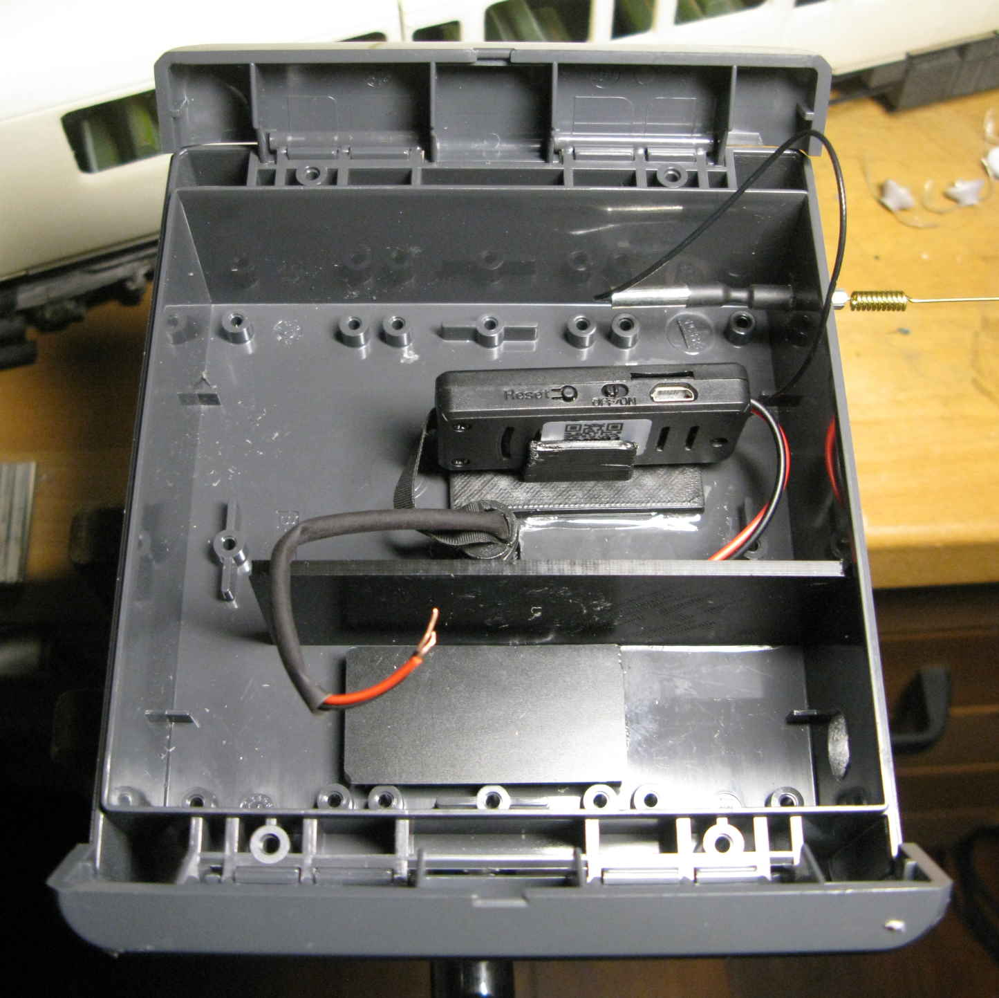
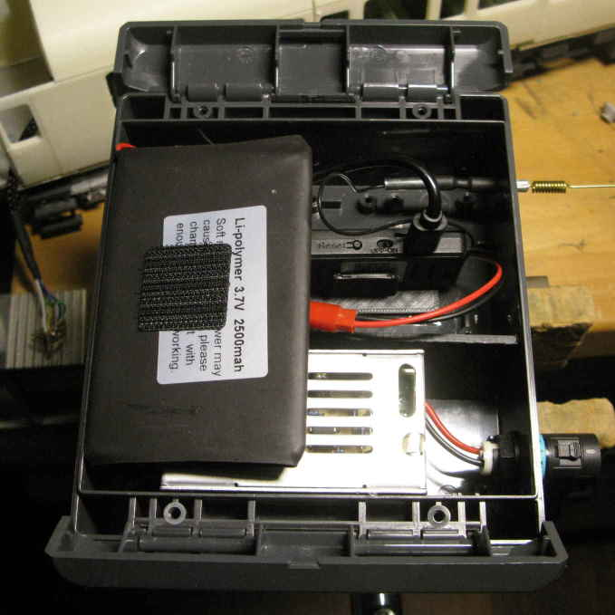
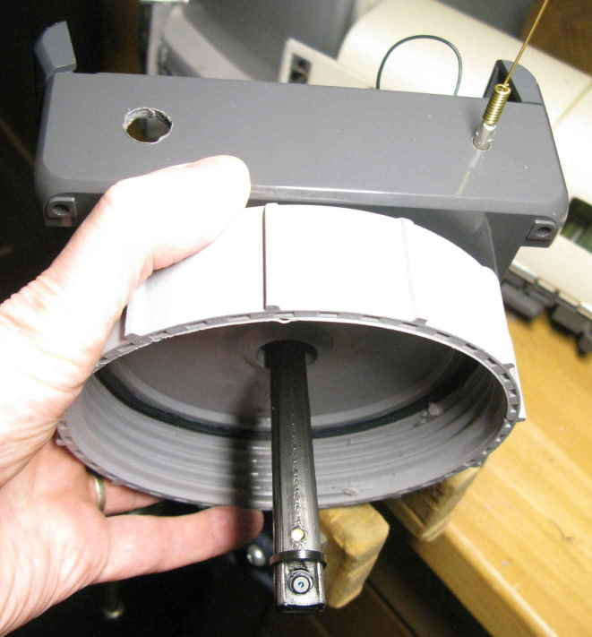
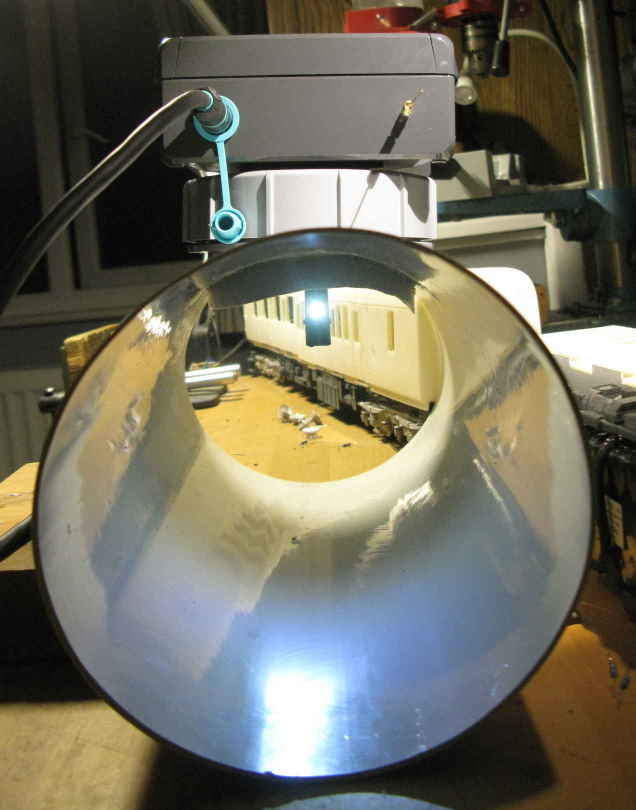

# Introduction

This repo contains bits for the Ferret Cam, part of the ferret tunnel project described here:

http://www.meades.org/ferrets/ferrets.html#Update_August_2019

Please refer to that link for more information.

# Off The Shelf Components

The camera itself was an [szbvcam](http://www.szbvcam.com/) purchased from [Amazon](https://www.amazon.co.uk/gp/product/B077K2TH1V/).  It consists of a small plastic module that is  the processing unit (connecting via Wifi), a high resolution camera on the end of a flat 10 cm long cable, a LiPo rechargeable battery and an antenna.  A USB connection to the procesing unit enables the battery to be charged.

To power the camera from a mains supply a mains-to-5 Volt switched-mode power supply module was purchased, also from [Amazon](https://www.amazon.co.uk/gp/product/B073GPSY4T).

Then to mount the lot a waterproof [plastic enclosure](https://uk.rs-online.com/web/p/general-purpose-enclosures/7739607/), 230 mm x 125 mm x 60 mm, was purchased from RSOnline, plus a [waterproof high voltage tee panel connector](https://uk.rs-online.com/web/p/lighting-connectors/1369903/) and matching [cable-mounted tee socket](https://uk.rs-online.com/web/p/lighting-connectors/1369898/).

A pack of [Vishay 3 mm high-brightness white LEDs](https://uk.rs-online.com/web/p/leds/8184452/) were also purchased from RSOnline.

# 3D Printed Parts

3D printed parts were created to mount the camera and illuminating LED safely (safe from ferrets that is) and ease the mounting of the components inside the enclosure.

All of the 3D printed parts were designed in Blender 100 times larger than real life, so something 1 centimetre long would be 1 metre long in this Blender file.  For 3D printing the parts should be exported to STL with a scale factor of 10 (since in Blender a scale factor of 1000 would normally result in STL actual size).

There were 6 parts:

* the two parts of the stalk that holds the webcam and LED,
* a large washer,
* a spacer to go underneath the PSU to avoid it fowling some fixings inside the enclosure,
* a mount for the webcam processing module,
* a partition to sit between the PSU, with its high voltage input. and the rest of the components.

The stalk should be printed at 0.1 mm resolution (with supports added in the slicer program) while the spacer, webcam processing module holder and partition should be printed at 0.2 mm resolution (no supports required).  I used black ASA for these parts since I had it lying around but PLA is perfectly acceptable.  The large washer was printed in flexible PLA at 0.2 mm resolution and a nice slow 15 mm/s print speed.

# Construction

A 12 mm diameter hole was drilled in the centre of the floor of the plastic enclosure for the 3D printed stalk to enter and a matching 20 mm diameter hole was drilled in the centre of the Osma screw-top hatch cover of the ferret tunnels.

A 270 ohm series resistor and solid-core leads were soldered to a high-brightness LED.  The leads were covered with heat-shrinkable sleeving so that the LED could be held neatly inside the 3D printed stalk.

The LED and the camera were threaded through the hole in the centre of the plastic enclosure, through the large 3D printed washer, between the two halves of the 3D printed stalk and into place.  The top of the 3D printed stalk was then wiggled-up through the hole and the bottom of the stalk was pushed down through the hole in the centre of the Osma screw-top hatch cover.  Two narrow cable ties were used to hold the two halves of the 3D printed stalk together, one positioned at the bottom between the LED and the camera, another positioned inside the enclosure right at the top of the stalk; the stalk is only held loosely to the enclosure, the large 3D printed washer will do most of the work.

Inside the enclosure the 3D printed spacer beneath the PSU, the 3D printed webcam processing module holder and the 3D printed partition were all glued into place with Araldite.  Holes were drilled in the enclosure for the tee panel power connector and the Wifi antenna.

Velcro sticky patches were used to keep the PSU in place on its spacer and the LiPo battery in place in the lid of the enclosure.  An old micro-USB cable was chopped-up to connect the USB socket on the webcam processing module to the 5 Volt terminals of the PSU.  Some mains cable from an old pond pump was re-purposed to connect the lot, via the cable-mounted tee socket, to a 3 Amp fused plug and hence a mains supply.

A few Neodimium magnets were glued to the OSMA screw-top hatch cover and the bottom of the plastic enclosure to hold the enclosure in place.

Here are a few pictures:






# Viewing

The camera offers an MJPEG stream at URL `http://IP_ADDRESS/video/livesp.asp#` but this only updates a few times a second.  Much better is an ASF stream which contains both an H264 video stream and mono 8 kHz ADPCM audio at URL `http://IP_ADDRESS/videostream.asf?user=admin&pwd=&resolution=32`.  However there doesn't seem to be an ASF plug-in for web browsers, you have to view the stream with something like [VLC Player](https://www.videolan.org/vlc/index.html).

To allow devices outside your home LAN  to see the video feed, convert your broadband provider's dynamic IP address into a static URL using a free service from the likes of [www.no-ip.com](www.no-ip.com), quote that address on your web page, then use Port Forwarding to get your router to forward incoming HTTP requests to the camera.

# Viewing In A Web Browser

To make the stream visible directly in a web browser you need to transcode it.  I did this using a Linux machine of my own on the public internet, from [Digital Ocean](https://www.digitalocean.com/).  This has the advantage that I could lock down the Port Forwarding on my router to the IP address of just that Linux machine, keeping my LAN more secure.  This Linux machine can have its URL fixed with the same [no-ip](www.no-ip.com) service.  I also changed the port that the camera responds on away from the ubiquitous `80`.

First I installed VLC on the Linux machine and opened an incoming firewall port on it for TCP traffic.  Then, to confirm that all the ports were open, I entered the following command to get VLC to send out a stream:

```
vlc -vvv http://CAM_USERNAME:CAM_PASSWORD@IP_ADDRESS:CAM_PORT/videostream.asf%26resolution=32 --sout "#transcode{vcodec=theo{quality=1},vb=800,acodec=mpga,ab=128,channels=2,samplerate=44100}:standard{access=http{mime=video/ogg},mux=ogg,dst=:LINUX_MACHINE_PORT/ferretcam.ogg}"
```

...with `CAM_USERNAME` and `CAM_PASSWORD` replaced by those of the camera, `IP_ADDRESS` and `CAM_PORT` replaced by the IP address (or fixed URL) of my router and the port of the camera and `LINUX_MACHINE_PORT` replaced by the port I had opened on the Linux machine.

I checked that it worked by opening the following stream in VLC on my local machine:

```
http://LINUX_MACHINE_IP_ADDRESS:LINUX_MACHINE_PORT/ferretcam.ogg
```

...with `LINUX_MACHINE_IP_ADDRESS`/`LINUX_MACHINE_PORT` replaced as appropriate.  The video should come streaming through.  When it didn't, I checked that the chosen port was open by running `netcat -v -l LINUX_MACHINE_PORT` on the Linux server and then `netcat -v LINUX_MACHINE_IP_ADDRESS LINUX_MACHINE_PORT` on my local machine (there are Windows versions of `netcat` out there); if the port is really open both ends will say so.  Anyway, after a few stumbles with my firewall setup it was all working.

Now, the streaming URL above works in Chrome but with a very long start-up delay and doesn't work at all in Microsoft Edge.  A much more portable solution is HTTP Live Streaming, for which a [Javascript client](https://github.com/video-dev/hls.js) is available that works in any browser.  VLC has a plug-in for HTTP Live Streaming but it can't will not use the HTTP server that is built into VLC, so next I needed to install Apache on the Linux machine with:

`sudo apt-get install apache2`

The `LINUX_MACHINE_PORT` I had opened above was not `80`, so I edited `ports.conf` with `sudo nano /etc/apache2/ports.conf` and changed the value of `80` to whatever `LINUX_MACHINE_PORT` was.  I restarted Apache with `sudo systemctl restart apache2` for this change to take effect and browsed to `http://LINUX_MACHINE_IP_ADDRESS:LINUX_MACHINE_PORT` to see the default Apache start-up page.

I then created directories with appropriate ownership and users as follows:

```
sudo mkdir /var/www/ferretcam
sudo mkdir /var/www/ferretcam/public_html
sudo useradd -c "VLC daemon" -d / -G audio -M -p \! -r -s /usr/bin/nologin -U vlcd
sudo chgrp -R audio /var/www/ferretcam
sudo chmod -R g+rwx /var/www/ferretcam
sudo usermod -a -G audio $USER
```

The third line creates a user called `vlcd` to run the VLC deamon (since VLC will not run as root) and puts that user in the `audio` group while the last line adds the current user to the audio group as well, so that I could run VLC on the command line and have it write to `/var/www/ferretcam`.  I logged out and back in again for the last line to take effect.

I copied the default Apache virtual configuration file to `ferretcam.conf` as follows:

`sudo cp /etc/apache2/sites-available/000-default.conf /etc/apache2/sites-available/ferretcam.conf`

I edited the copied file with:

`sudo nano /etc/apache2/sites-available/ferretcam.conf`

I changed the port at the top of the file to match `LINUX_MACHINE_PORT`.  I changed `ServerAdmin` to my e-mail address, `DocumentRoot` to `/var/www/ferretcam/public_html` and then added a directive `ServerName LINUX_MACHINE_IP_ADDRESS` where `LINUX_MACHINE_IP_ADDRESS` is the IP address, or preferably the URL, of the Linux machine.

I enabled the site with:

`sudo a2ensite ferretcam.conf`

...disable the default site with:

`sudo a2dissite 000-default.conf`

...and then restarted Apache with:

`sudo  systemctl reload apache2`

Then I started VLC with its HTTP Live Streaming interface as follows:

```
vlc -I dummy http://CAM_USERNAME:CAM_PASSWORD@IP_ADDRESS:CAM_PORT/videostream.asf%26resolution=32 vlc://quit --sout='#transcode{vcodec=h264,vb=256,venc=x264{aud,profile=baseline,level=30,keyint=30,ref=1},acodec=mp3,ab=96}:std{access=livehttp{seglen=10,delsegs=true,numsegs=5,index=/var/www/ferretcam/public_html/ferretcam.m3u8,index-url=http://LINUX_MACHINE_IP_ADDRESS:LINUX_MACHINE_PORT/ferretcam/public_html/ferretcam-########.ts},mux=ts{use-key-frames},dst=/var/www/ferretcam/public_html/ferretcam-########.ts}'
```

On my local machine, I browsed to `http://LINUX_MACHINE_IP_ADDRESS:LINUX_MACHINE_PORT/` and could see a set of `ferretcam` files, including `ferretcam.m3u8` and a number of `.ts` files.

Then I copied the files from the `http` folder of this repo into the `/var/www/ferretcam/public_html` directory on the Linux machine and ran VLC manaully as above manually once more. I browsed to http://LINUX_MACHINE_IP_ADDRESS:LINUX_MACHINE_PORT/ then pressed the "play" button in the middle of the video to make the stream play; the reason for the button is that, unless you are a privileged source like YouTube or similar, mobile and sometimes desktop browsers will not play a video stream from your site without user interaction.  The stream ran at around 30 seconds behind real time, though this can be adjusted by fiddling with the HLS config.

To make the VLC transcoder run at startup on the Linux machine, I created a file called `/etc/systemd/system/ferretcam.service` with the following contents:

```
[Unit]
Description=FerretCam video transcoder
After=network.target

[Install]
WantedBy=multi-user.target

[Service]
# Start VLC service
User=vlcd
ExecStart=/usr/bin/vlc -I dummy http://CAM_USERNAME:CAM_PASSWORD@IP_ADDRESS:CAM_PORT/videostream.asf%%26resolution=32 --daemon --syslog  vlc://quit --sout="#transcode{vcodec=h264,vb=256,venc=x264{aud,profile=baseline,level=30,keyint=30,ref=1},acodec=mp3,ab=96}:std{access=livehttp{seglen=5,delsegs=true,numsegs=10,index=/var/www/ferretcam/public_html/ferretcam.m3u8,index-url=ferretcam-########.ts},mux=ts{use-key-frames},dst=/var/www/ferretcam/public_html/ferretcam-########.ts}"
Restart=always
RestartSec=10
Type=forking

[Install]
WantedBy=multi-user.target
```

...with `CAM_USERNAME` and `CAM_PASSWORD` replaced by those of the camera and `IP_ADDRESS` and `CAM_PORT` replaced by the IP address (or fixed URL) of my router and the port of the camera.

I started the service with `sudo systemctl start ferretcam` (using `sudo journalctl -xe` to check what went wrong when it didn't start) and checked once more that I could receive the stream in a browser.  With this confimed I enabled the stream to start at boot with `sudo systemctl enable ferretcam`.